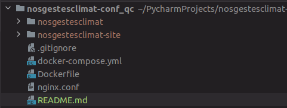

Repo used to configure nosgestesclimat on gcp

You need to clone nosgestesclimat_qc (folder renamed as nosgestesclimat) 
and nosgestesclimat-site_qc (named as (folder renamed as nosgestesclimat-site)) inside this project repo like this

configuration_cors_gcp.json :
gsutil cors set configuration_cors_gcp.json gs://nosgestesclimat-qc-data/